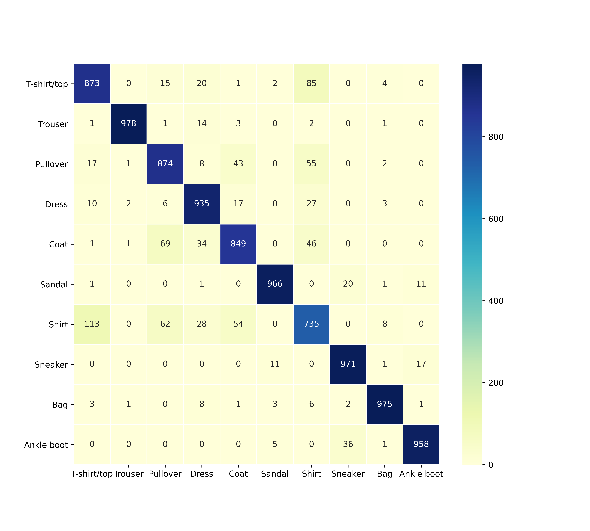

# Homework 2, JUL/8/2021

## Deadline: 10:30 PM, JUL/13/2021, TUE (BJT)

## Requirements
1. Implement a CNN, RNN in Python.
2. Apply the algorithms to real world problems of your choice.
3. Compare their efficiency and accuracy.
4. Prepare a ppt presentation of your resuilts.

## Tasks
- [x] Read the README file
- [x] Write CNN classifier using pytorch
- [x] Write RNN classifier using pytorch
- [x] Prepare the Fashion MNIST training set for CNN
- [x] Prepare the Fashion MNIST training set for RNN
- [x] Fine-tuning the CNN on training set (cross validation)
- [ ] Fine-tuning the RNN on training set (cross validation)
- [x] Measure CNN performance on test set
    - [x] Accuracy, precision, and recall
    - [x] F scores
    - [x] Confusion matrix in heatmap
    - [x] Overfitting
- [ ] Measure RNN performance on test set
    - [ ] Accuracy, precision, and recall
    - [ ] F scores
    - [ ] Confusion matrix in heatmap
    - [ ] Overfitting
- [ ] Make slides, prepare presentation

## Meaurement results
### CNN

#### Test Set
| Model       | Accuracy    | Precision     | F1 Score      | Recall       |
|   :----:    |    :----:   |     :----:    |   :---:       |  :---:       |
| Conv-MaxPool | 90.57%      | 90.56%        | 90.51%        | 90.57%       |
| **Stride-Conv** | **90.67%**      | **90.64%**        | **90.61%**        | **90.67%**       |
| Small-Conv  | 89.11%      | 89.06%        | 89.04%        | 89.11%       |

#### Vallidation Set
| Model       | Accuracy    |
|   :----:    |    :----:   |
| Conv-MaxPool | 91.20%      |
| Stride-Conv | 91.38%      |
| Small-Conv  | 90.62%      |

#### Training Set
| Model       | Accuracy    |
|   :----:    |    :----:   |
| Conv-MaxPool | 94.94%      |
| Stride-Conv | 94.56%      |
| Small-Conv  | 92.85%      |

#### Stride-Conv Heatmap on Test dataset
